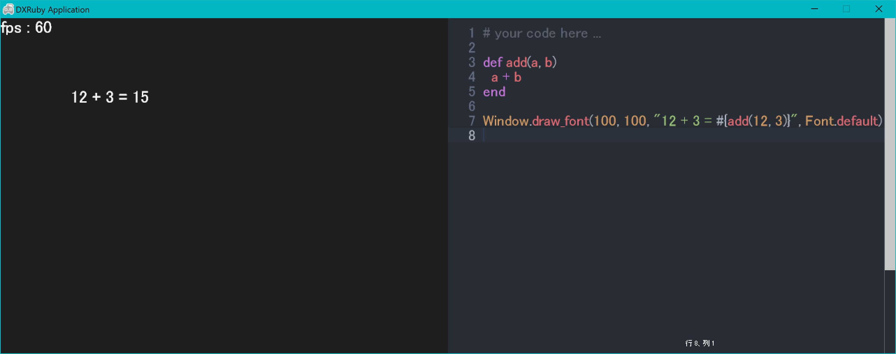

# DXRubyEditor
An editor (similar to vscode) and runtime environment for DXRuby.




## Installation

```ruby
gem install 'dxruby_editor'
```


## Usage

```ruby
require 'dxruby_editor'

Window.width = 1280

editor = DXRubyEditor::Editor.new(640, 480, page_height: 800)

Window.loop do
  break if Input.key_down?(K_ESCAPE)

  Window.draw_font(0, 0, "fps : #{Window.real_fps}", Font.default)
end
```


## Contributing
1. Fork it
2. Create your feature branch (`git checkout -b my-new-feature`)
3. Commit your changes (`git commit -am 'Add some feature'`)
4. Push to the branch (`git push origin my-new-feature`)
5. Create new Pull Request


## [LICENSE](./LICENSE)
The gem is available as open source under the terms of the [MIT License](https://opensource.org/licenses/MIT).
